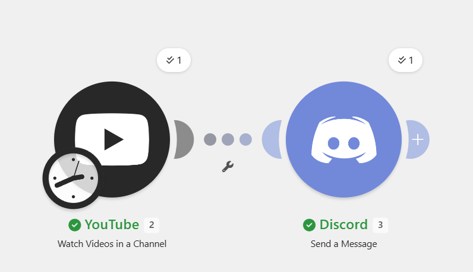
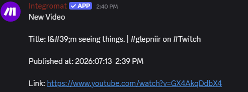

# YouTube Upload Tracker

## Problem

Subscribers don't always have time to manually check whether their favorite creator has uploaded a new video.

## Solution

This Make automation monitors a YouTube channel for new uploads and automatically sends a Discord notification containing the video's title, publish date, and direct link.

## Services Used

- Make
- YouTube
- Discord

## Skills Demonstrated

- YouTube integration
- Content monitoring
- Date formatting
- Dynamic field mapping
- Discord notifications

## Workflow

YouTube → Make → Discord

## Screenshots

### Make Scenario

### Discord Output

